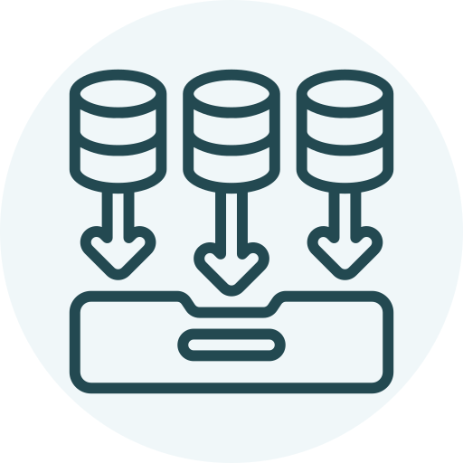

# Data Plan 

## Purpose
The purpose of the data plan is to document what data is needed for the analysis, where it can be sourced from, who owns or manages it and the refresh frequency.

This project will employ a [dimensional data model](https://www.guru99.com/dimensional-model-data-warehouse.html) to support the analytics and visuals. Structuring the source data into a dimensional model allows for simpler expansion as more questions arise, and it can be easily transported into other similar projects and larger data models. Furthermore, dimensional modeling is the preferred format for certain business intelligence tools such as [Microsoft Power BI](https://powerbi.microsoft.com). This plan outlines the structure of the dimensional data model in terms of dimension (lookup) tables and fact tables.

## Data Plan

## Dimensional Data Model Matrix