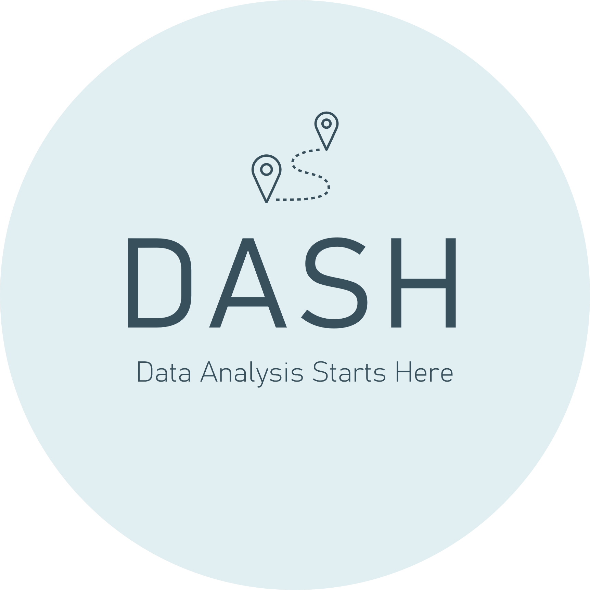
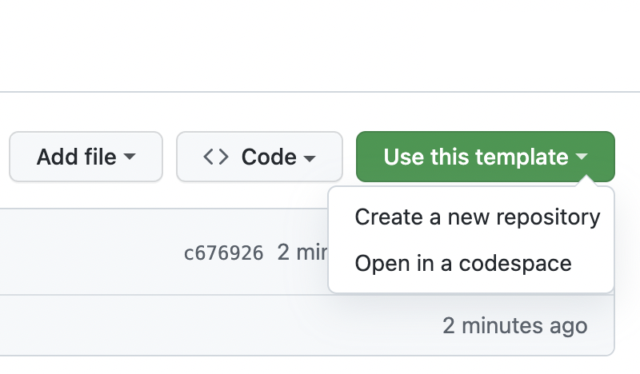

# DASH 

Data Analysis Starts Here (DASH)

# Purpose
To provide an open-source toolbox that enables data analysts to produce consistent, well-documented data analysis projects. Template scripts are written in R but could be adapted to Python or any other suitable language for data analysis.

# Getting started
This template repository contains sample data, documentation and analysis as an example of a data analysis project that follows DASH methodology. You can replace the data and customize the template files and scripts to suit your own project.

## Create a new repository from this template
To get started, you should create a new repository from this template for your own data analysis project. You can do this by clicking on **Use this template** above the file list on the main page of this repository, and then choosing **Create a new repository**.

|  |
|:----------------------------------------------------------------------:|
| *The Use this template button on a Github template repository home page. Image: Github* |

Full guidance on creating a new repository from a Github template can be found [here](https://docs.github.com/en/repositories/creating-and-managing-repositories/creating-a-repository-from-a-template).

## Customizing the README
In your new repository, delete `README.md`. Rename `sampleREADME.md` to `README.md`. Customize the new `README.md` file as required to fit your own project. Don't forget to customize the contact information at the bottom of the new `README.md` file.

## Customizing the documentation
The project documentation folders are numbered `01` to `05`. Within each folder are templates that you can customize to support your data analysis, including the project's goals or the business use case, the intended stakeholders, key performance indicators (KPIs), data sources and assumptions, data preparation steps, exploratory data analysis, explanatory analysis, insights and optimizations. Access each folder in turn to customize the documentation to your project.

# Acknowledgements
This template is inspired by various online data analysis courses and articles, including:

-   [Thinking Like An Analyst](https://mavenanalytics.io/course/thinking-like-an-analyst) by [Maven Analytics](https://mavenanalytics.io)
-   [7 Fundamental Steps to Complete a Data Analytics Project](https://blog.dataiku.com/2019/07/04/fundamental-steps-data-project-success) by [Dataiku](https://www.dataiku.com)
-   [How to create a measurement plan and why you really need one](https://www.freshegg.co.uk/blog/analytics/performance-measurement/how-to-create-a-measurement-plan-and-why-you-really-need-one/) by [Fresh Egg](https://www.freshegg.co.uk)
-   [Digital Marketing and Measurement Model](https://www.kaushik.net/avinash/digital-marketing-and-measurement-model/) by [Kaushik](https://www.kaushik.net)

The icons used in this project were made by the following authors from [Flaticon](www.flaticon.com):

-   [Alfanz](https://www.flaticon.com/authors/alfanz)
-   [juicy_fish](https://www.flaticon.com/authors/juicy-fish)
-   [Uniconlabs](https://www.flaticon.com/authors/uniconlabs)

# Contact
You can use the following channels to get in touch with me about this project:

-   [Email me](mailto:surreydatagirl@gmail.com) for any questions about the project, or to collaborate with me on making it better.
-   [GitHub Issues](https://github.com/clarelgibson/dash/issues) for direct feedback, enhancement requests or raising bugs.