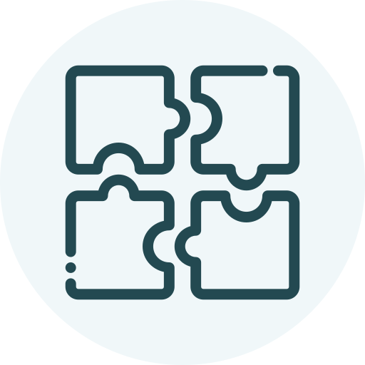

# DASH 

Data Analysis Starts Here (DASH)

# Purpose
To provide an open-source toolbox that enables data analysts to produce consistent, well-documented data analysis projects.

# Getting started
This template repository contains the folder structures and boilerplate documentation needed to create a data analysis project following the DASH methodology.

## Create a new repository from this template
To get started, you should create a new repository from this template for your own data analysis project. You can do this by clicking on **Use this template** above the file list on the main page of this repository, and then choosing **Create a new repository**.

|  |
|:----------------------------------------------------------------------:|
| *The Use this template button on a Github template repository home page. Image: Github* |

Full guidance on creating a new repository from a Github template can be found [here](https://docs.github.com/en/repositories/creating-and-managing-repositories/creating-a-repository-from-a-template).

## Customizing the README
In your new repository, delete everything above the horizontal rule. Replace any text in curly braces (`{}`) with your own.

## Customizing the wiki
The project wiki is where you will include all documentation to support your data analysis, including the project's goals or the business use case, the intended stakeholders, key performance indicators (KPIs), data sources and data assumptions.

Navigate to the wiki area and complete the information on each page as directed.

# Acknowledgements
This project is inspired by various online data analysis courses and articles, including:

-   [Thinking Like An Analyst](https://mavenanalytics.io/course/thinking-like-an-analyst) by [Maven Analytics](https://mavenanalytics.io)
-   [7 Fundamental Steps to Complete a Data Analytics Project](https://blog.dataiku.com/2019/07/04/fundamental-steps-data-project-success) by [Dataiku](https://www.dataiku.com)

The icons used in this project were made by the following authors from [Flaticon](www.flaticon.com):

-   [Alfanz](https://www.flaticon.com/authors/alfanz)
-   [juicy_fish](https://www.flaticon.com/authors/juicy-fish)
-   [Uniconlabs](https://www.flaticon.com/authors/uniconlabs)

# Contact
You can use the following channels to get in touch with me about this project:

-   [Email me](mailto:surreydatagirl@gmail.com) for any questions about the project, or to collaborate with me on making it better.
-   [GitHub Issues](https://github.com/clarelgibson/dash/issues) for direct feedback, enhancement requests or raising bugs.

##### DELETE EVERYTHING ABOVE THIS LINE AFTER COPYING THE TEMPLATE TO A NEW REPO
---
# {PROJECT ABBREVIATED NAME} 

{Full project name}

# Project Goals

{State the major goals of the data analysis project in a concise manner. More details can be provided in the wiki.}