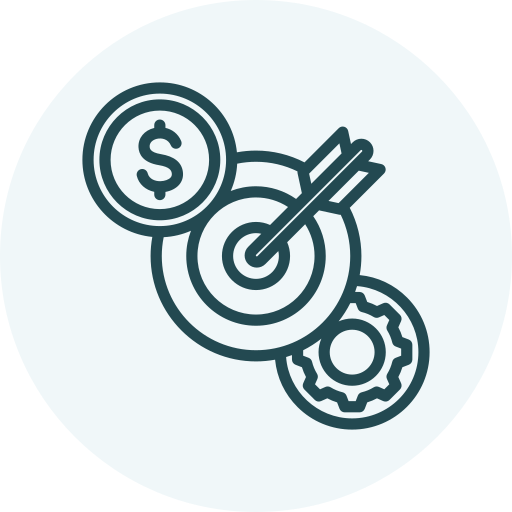
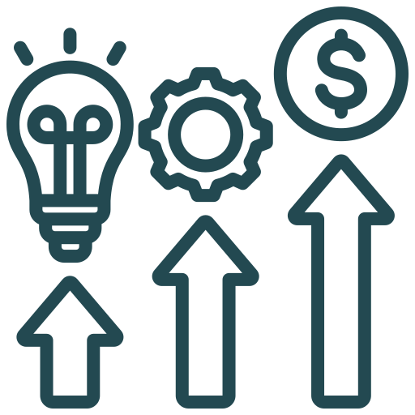
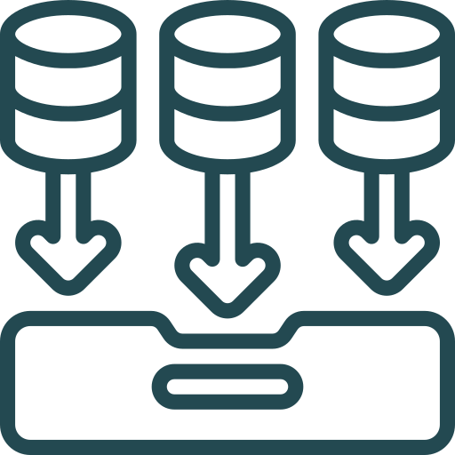
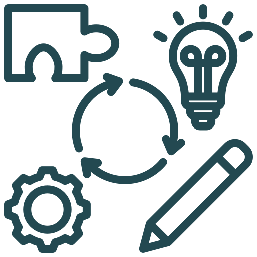

# The data analyst roadmap

## Set the goals 
* What specific outcomes are you trying to impact?
* Who are your key stakeholders?
* What motivates your stakeholders?
* What actions do you want your stakeholders to take after seeing your analysis?
* How does your analysis fit into the bigger picture?

## Set the KPIs 
* What would a successful outcome look like?
* Which KPIs align with that outcome?
* What do you need to capture and track to optimize those metrics?

## Gather the data 
Any analysis is only as strong as the data supporting it. It can take a very long time to build trust, and only seconds to destroy it. If you don't take care to properly prepare, clean and QA your data, you run the risk of presenting misleading data and hurting your reputation.

Data prep tends to be one of the most time-consuming stages of this workflow, because it requires a unique combination of skills and techniques including quality assurance, data profiling, feature engineering and ETL automation.

## Understand the data 
* What exactly does each record represent?
* Which fields are most relevant to my analysis?
* What are the summary statistics of each field?
* Are there any important nuances or industry-specific metrics?

## Analyse the data 
This step is about bringing your data to life. Humans are poorly equipped to interpret raw data. Visualisation helps to expose patterns to make sense of complex data. This helps you to create powerful narratives.

## Find insights 
Another common mistake is when analysts fail to translate their analysis into insights and outcomes. A strong insight tells a clear, data-driven story and provides actionable recommendations to drive the key outcomes in your measurement plan. This is easier said than done!

## Iterate 
This is about closing the loop. Once your recommendations have been implemented you need to quantify the impact that you drove from your analysis (in dollars, if possible) and seek new opportunities to continue to develop.

# Acknowledgements

Icons made by <a href="https://www.flaticon.com/authors/juicy-fish" title="juicy_fish">juicy_fish</a> from <a href="https://www.flaticon.com/" title="Flaticon">www.flaticon.com</a>

Icons made by <a href="https://www.flaticon.com/authors/uniconlabs" title="Uniconlabs">Uniconlabs</a> from <a href="https://www.flaticon.com/" title="Flaticon">www.flaticon.com</a>

