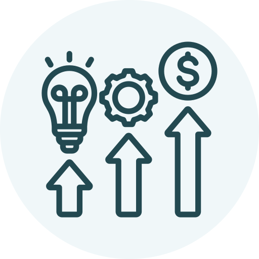

[Home](./)

# The DASH framework
The DASH framework is organized around four distinct project phases. Click on each phase for the related tutorial.

### [Planning](/dash/planning) 
The planning phase...

### Wrangling 
The wrangling phase...

### Delivering
The delivery phase...

### Optimizing
The optimizing phase...

## How to get involved?
Want to contribute to this project?